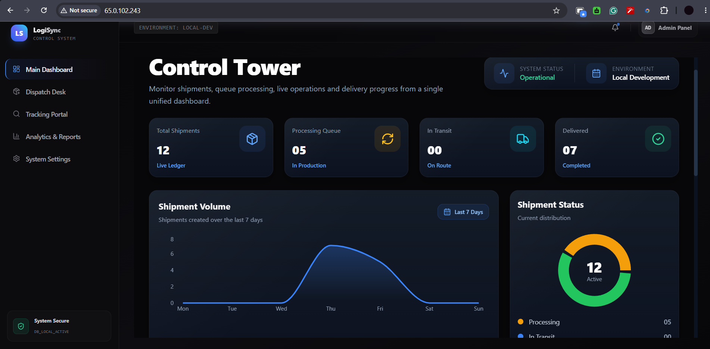
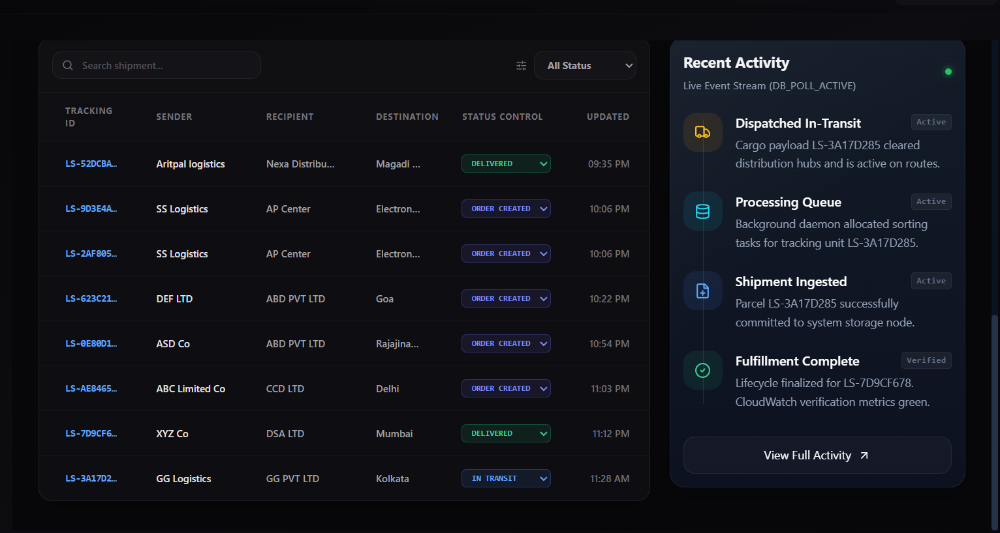
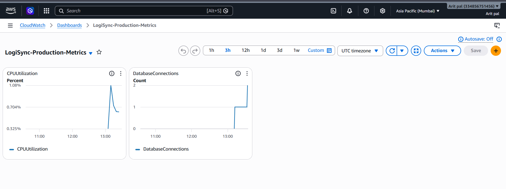
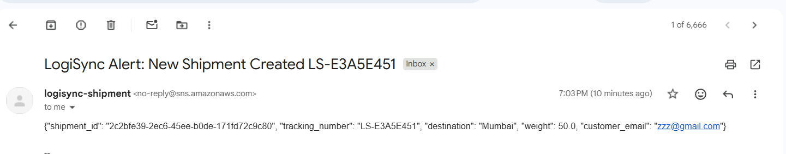
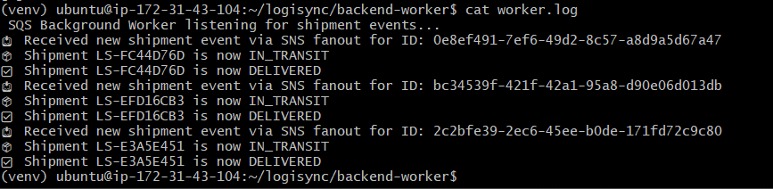

# LogiSync: Real-Time Logistics Control & Tracking Platform

LogiSync is a decoupled, event-driven logistics orchestration platform designed for enterprise scalability and 100% AWS Free Tier compliance. It features a modern single-page frontend application interacting with a high-throughput asynchronous API server and an isolated background worker task manager.

---

## 🗺️ System Architecture

```
[ Client Browser ] --- (Port 80/443) ---> [ Nginx Web Server (EC2) ]
                                                   |
                   +-------------------------------+-------------------------------+
                   | (Static Routing)                                              | (Reverse Proxy API Routing)
                   v                                                               v
       [ Compiled React Frontend ]                                     [ Python FastAPI / Uvicorn ] ----+
                                                                                   |                    |
                                                                        (boto3)    | (SQLAlchemy)       | (boto3)
                                                                 +-----------------+-----------------+  |
                                                                 |                                   |  v
                                                          [ Amazon SQS Queue ]              [ Amazon RDS Postgres ]
                                                                 |                                      |
                                                                 | (Long Polling)                       | (boto3)
                                                                 v                                      v
                                                       [ Background Worker ] ------------------> [ AWS CloudWatch ]
                                                                 |                             (Telemetry Logs)
                                                                 | (Trigger Event)
                                                                 v
                                                          [ Amazon SNS ] ---> [ Customer Email Notifications ]
```

---

## 🛠️ Tech Stack & Service Blueprint

### Core Software Stack

- **Frontend:** React.js, Tailwind CSS *(Built utilizing native DOM rendering, bypassing heavy compilation tooling constraints)*.
- **Backend Engine:** Python, FastAPI, Uvicorn ASGI server.
- **Database Mapping:** SQLAlchemy Object Relational Mapper (ORM).

### Production Cloud Infrastructure (AWS)

- **Compute Engine:** Amazon EC2 (Ubuntu Linux T2.Micro) running Nginx as a high-performance reverse proxy and static asset delivery system.
- **Database Engine:** Amazon RDS fully managed PostgreSQL instance isolated from direct public routing.
- **Message Broker:** Amazon SQS handling non-blocking background queue tasks asynchronously.
- **Notification System:** Amazon SNS managing instant customer operational update emails.
- **Telemetry & Logging:** AWS CloudWatch capturing unified system runtime metrics and structured worker process logs.

---

## 📸 Production Previews & Telemetry

### 1. High-Fidelity Infrastructure Architecture

The complete architectural deployment pipeline showing event processing, pub/sub notification pathways, and system topology.


### 2. Unified Control Tower Dashboard

The central operational command center displaying dynamic shipment distributions, live ledger state metrics, and global environment statuses.



### 3. Live Shipment Routing Ledger

The live user-facing activity feed showing real-time background ingest indicators and automated shipment lifecycle state transitions.



### 4. Real-Time CloudWatch Telemetry Observability

Monitored infrastructure telemetry spikes captured in real time, charting concurrent spikes across **EC2 CPU Utilization** and **Amazon RDS Database Connections** under load.



### 5. Automated Pub/Sub Email Notifications

Tangible verification of the Amazon SNS fanout pipeline delivering real-time raw JSON operational event alerts to customer end-clients.



### 6. Decoupled Asynchronous Background Worker Logs

Live low-level shell output of the isolated Python worker performing long-polling on SQS to ingest, route, and update tracking state states safely.



---

## 💻 Local Installation & Setup

### Prerequisites

- Python 3.10+
- Node.js & npm

### 1. Backend API Configuration

```bash
cd backend-api
python -m venv venv

# Windows execution:
.\venv\Scripts\activate

pip install -r requirements.txt
uvicorn main:app --reload --port 8080
```

### 2. Frontend Deployment Setup

```bash
cd frontend
npm install
npm start
```

---

## 🛡️ Cloud Deployment Blueprint (AWS Pipeline)

1. **Repository Access:** Execute `git clone` directly inside the Amazon EC2 Linux instance environment.
2. **Web Serving:** Compile the React layer utilizing `npm run build` and link the output directory to Nginx internal file trackers.
3. **Daemon Configuration:** Establish the FastAPI and Worker processes as active system processes utilizing standard Linux `systemd` service manifests.
4. **Network Security:** Whitelist the internal EC2 private IP within the Amazon RDS Security Group firewalls to block all standard public traffic vectors.
